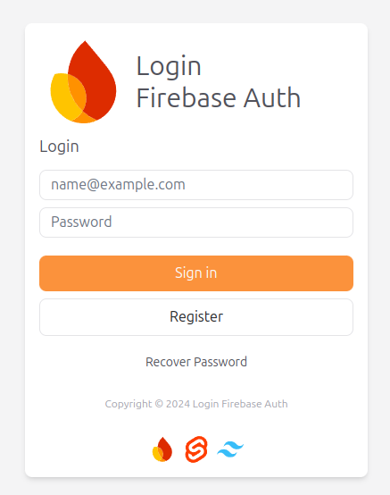

# Login Firebase Auth ( Svelte + Tailwindcss )

<p align="center">

</p>
<br>

<div style="display: flex; align-items: end; justify-content: center; gap: 2rem;">
    <div style="display: flex; align-items: end;">
        
        <span style="font-size: 2rem;">Firebase</span>
    </div>
    <div style="display: flex; align-items: end;">
        
        <span style="font-size: 2rem;">Svelte</span>
    </div>
    <div style="display: flex; align-items: end;">
        
        <span style="font-size: 2rem;">Tailwindcss</span>
    </div>
</div>

## 🚀 Project Technologies
- **[Firebase Authentication](https://firebase.google.com/docs/auth)**: Fornece back-end services, SDKs fáceis de usar e bibliotecas UI para autenticar usuários na aplicação.
- **[Svelte](https://svelte.dev/)**: Com uma abordagem diferente para a construção de interfaces de usuário. O Svelte compila seu código em JavaScript otimizado que atualiza o DOM quando necessário.
- **[Tailwind CSS](https://tailwindcss.com/)**: Um framework CSS utilitário para criar rapidamente designs personalizados.

## 🚀 Project Structure
```text
/
├── eslint.config.js
├── node_modules
├── package.json
├── package-lock.json
├── postcss.config.js
├── README.md
├── src
├── static
├── svelte.config.js
├── tailwind.config.ts
├── tsconfig.json
└── vite.config.ts

```
# create-svelte

Everything you need to build a Svelte project, powered by [`create-svelte`](https://github.com/sveltejs/kit/tree/main/packages/create-svelte).

## Creating a project

If you're seeing this, you've probably already done this step. Congrats!

```bash
# create a new project in the current directory
npm create svelte@latest

# create a new project in my-app
npm create svelte@latest my-app
```

## Developing

Once you've created a project and installed dependencies with `npm install` (or `pnpm install` or `yarn`), start a development server:

```bash
npm run dev

# or start the server and open the app in a new browser tab
npm run dev -- --open
```

## Building

To create a production version of your app:

```bash
npm run build
```

You can preview the production build with `npm run preview`.

> To deploy your app, you may need to install an [adapter](https://kit.svelte.dev/docs/adapters) for your target environment.
